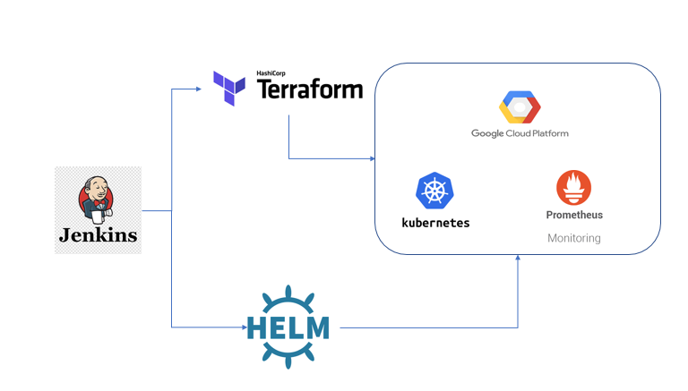

# Google Kubernetes Engine (GKE) module with Helm & Terraform (CI/CD Pipeline)

This repo contains a [Terraform](https://www.terraform.io) module for running a Kubernetes cluster on [Google Cloud Platform (GCP)](https://cloud.google.com/) using [Google Kubernetes Engine (GKE)](https://cloud.google.com/kubernetes-engine/) and application deployment in GKE Cluster using helm package manager.

## What's in this repo

This repo has the following folder structure:

* [modules](https://github.com/gruntwork-io/terraform-google-gke/tree/master/modules): This folder contains the
  main implementation code for this Module, broken down into multiple standalone submodules.

  The primary module is:

    * [gke-cluster](https://github.com/Babug01/k8s_deployment/tree/master/modules/gke-cluster): The GKE Cluster module is used to
    administer the [cluster master](https://cloud.google.com/kubernetes-engine/docs/concepts/cluster-architecture)
    for a [GKE Cluster](https://cloud.google.com/kubernetes-engine/docs/how-to/cluster-admin-overview).

    There are also several supporting modules that add extra functionality on top of `gke-cluster`:

    * [gke-service-account](https://github.com/Babug01/k8s_deployment/tree/master/modules/gke-service-account):
    Used to configure a GCP service account for use with a GKE cluster.

	* [helloworld] (https://github.com/Babug01/k8s_deployment/tree/master/helloworld): This is the application we are deploying into the cluster using Helm.
	
## What is Kubernetes?

[Kubernetes](https://kubernetes.io) is an open source container management system for deploying, scaling, and managing
containerized applications. Kubernetes is built by Google based on their internal proprietary container management
systems (Borg and Omega). Kubernetes provides a cloud agnostic platform to deploy your containerized applications with
built in support for common operational tasks such as replication, autoscaling, self-healing, and rolling deployments.

You can learn more about Kubernetes from [the official documentation](https://kubernetes.io/docs/tutorials/kubernetes-basics/).

## What is GKE?

Google Kubernetes Engine or "GKE" is a Google-managed Kubernetes environment. GKE is a fully managed experience; it
handles the management/upgrading of the Kubernetes cluster master as well as autoscaling of "nodes" through "node pool"
templates.

Through GKE, your Kubernetes deployments will have first-class support for GCP IAM identities, built-in configuration of
high-availability and secured clusters, as well as native access to GCP's networking features such as load balancers.

## <a name="how-to-run-applications"></a>How do you run applications on Kubernetes?

There are three different ways you can schedule your application on a Kubernetes cluster. In all three, your application
Docker containers are packaged as a [Pod](https://kubernetes.io/docs/concepts/workloads/pods/pod/), which are the
smallest deployable unit in Kubernetes, and represent one or more Docker containers that are tightly coupled. Containers
in a Pod share certain elements of the kernel space that are traditionally isolated between containers, such as the
network space (the containers both share an IP and thus the available ports are shared), IPC namespace, and PIDs in some
cases.

Pods are considered to be relatively ephemeral disposable entities in the Kubernetes ecosystem. This is because Pods are
designed to be mobile across the cluster so that you can design a scalable fault tolerant system. As such, Pods are
generally scheduled with
[Controllers](https://kubernetes.io/docs/concepts/workloads/pods/pod-overview/#pods-and-controllers) that manage the
lifecycle of a Pod. Using Controllers, you can schedule your Pods as:

- Jobs, which are Pods with a controller that will guarantee the Pods run to completion.
- Deployments behind a Service, which are Pods with a controller that implement lifecycle rules to provide replication
  and self-healing capabilities. Deployments will automatically reprovision failed Pods, or migrate Pods to healthy
  nodes off of failed nodes. A Service constructs a consistent endpoint that can be used to access the Deployment.
- Daemon Sets, which are Pods that are scheduled on all worker nodes. Daemon Sets schedule exactly one instance of a Pod
  on each node. Like Deployments, Daemon Sets will reprovision failed Pods and schedule new ones automatically on
  new nodes that join the cluster.

## What's a Module?

A Module is a canonical, reusable, best-practices definition for how to run a single piece of infrastructure, such
as a database or server cluster. Each Module is written using a combination of [Terraform](https://www.terraform.io/)
and scripts (mostly bash) and include automated tests, documentation, and examples. It is maintained both by the open
source community and companies that provide commercial support.

Instead of figuring out the details of how to run a piece of infrastructure from scratch, you can reuse
existing code that has been proven in production. And instead of maintaining all that infrastructure code yourself,
you can leverage the work of the Module community to pick up infrastructure improvements through
a version number bump.

## Contents:
	- Architecture Diagram
	- Prerequistes
	- Installation of terraform, Helm and kubergrunt
	- Jenkins setup
	- Application (Helloworld)
	- Logs Monitor
	
	
## Architecture Diagram



## Prerequistes

- GCP Account
- Jenkins
- Terraform
- Helm

## Installation

### Create an GCP account
It is very easy to create a GCP account. Sign up for a gmail account and you are ready to go. You can also use your existing gmail account, if you have any.

[GCP console][https://console.cloud.google.com/home/]

### Jenkins

Jenkins is an open-source automation server that automates the repetitive technical tasks involved in the continuous integration and delivery of software. Jenkins is Java-based and can be installed from Ubuntu packages or by downloading and running its web application archive (WAR) file — a collection of files that make up a complete web application to run on a server.

First, add the repository key to the system:
```
$ wget -q -O - https://pkg.jenkins.io/debian/jenkins.io.key | sudo apt-key add -
```

When the key is added, the system will return OK. Next, append the Debian package repository address to the server’s sources.list:
```
$ sudo sh -c 'echo deb http://pkg.jenkins.io/debian-stable binary/ > /etc/apt/sources.list.d/jenkins.list'
```

When both of these are in place, run update so that apt will use the new repository:
```
$ sudo apt update
```

Finally, install Jenkins and its dependencies:
```
$ sudo apt install jenkins
```

Let's start Jenkins using systemctl:
```
$ sudo systemctl start jenkins
```

Check the Status:
```
$ sudo systemctl status jenkins
```
Output
```
$ ● jenkins.service - LSB: Start Jenkins at boot time
   Loaded: loaded (/etc/init.d/jenkins; generated)
   Active: active (exited) since Mon 2018-07-09 17:22:08 UTC; 6min ago
     Docs: man:systemd-sysv-generator(8)
    Tasks: 0 (limit: 1153)
   CGroup: /system.slice/jenkins.service
```
Setting the jenkins: [https://www.digitalocean.com/community/tutorials/how-to-install-jenkins-on-ubuntu-18-04]

### Terraform

Download latest version of the terraform (substituting newer version number if needed)
```
$ wget -q https://releases.hashicorp.com/terraform/0.11.6/terraform_0.11.6_linux_amd64.zip
```

Extract the downloaded file archive
```
$ unzip terraform_0.12.8_linux_amd64.zip
  Archive:  terraform_0.12.8_linux_amd64.zip
  inflating: terraform
```

Move the executable into a directory searched for executables
```
$ sudo mv terraform /usr/local/bin/terraform
```

Run it and check the version
```
$ terraform version
Terraform v0.12.8
```

### Helm and Kubergrunt

kubergrunt is a standalone go binary with a collection of commands that attempts to fill in the gaps between Terraform, Helm, and Kubectl for managing a Kubernetes Cluster.

Some of the features of kubergrunt include:

- Configuring kubectl to authenticate with a given EKS cluster. Learn more about authenticating kubectl to EKS in the our production deployment guide.
- Managing Helm and associated TLS certificates on any Kubernetes cluster.
- Setting up Helm client with TLS certificates on any Kubernetes cluster.
- Generating TLS certificate key pairs and storing them as Kubernets Secrets on any Kubernetes cluster.

```
$ gruntwork-install --binary-name "kubergrunt" --repo "https://github.com/gruntwork-io/kubergrunt" --tag "v0.5.8"
[https://github.com/gruntwork-io/kubergrunt]
```

## CI/CD Flow:

1. Jenkins will trigger terraform to create the private cluster in GKE in GCP portal.
2. Once cluster is created in GKE, the Helm package manager will start deploy the [Hello World], application in cluster.
```
# DEPLOYMENT

resource "null_resource" "deployment" {
  provisioner "local-exec" {
    command = <<-EOF
	helm install helloworld/  --generate-name;
    EOF
	}
  depends_on = [null_resource.wait_for_tiller]
}

```
3. Application is deployed successfully. Please use below URL to check the deployed applications,
```
/app1
 -  
/app2
 - 
``` 
4. Use below URL to check the logs.


## Completed !!!
